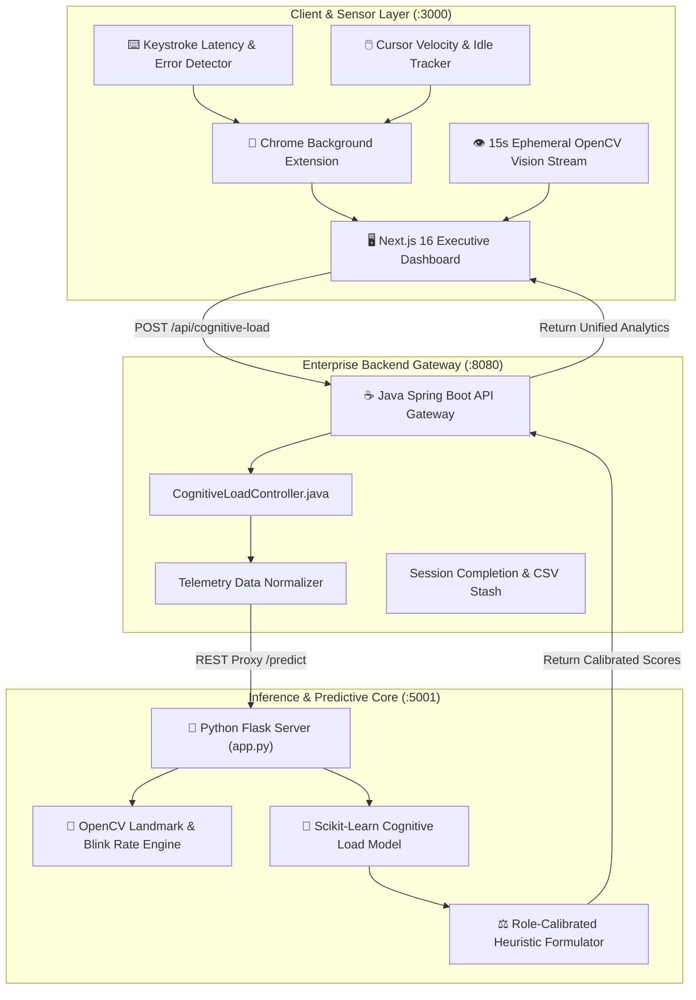
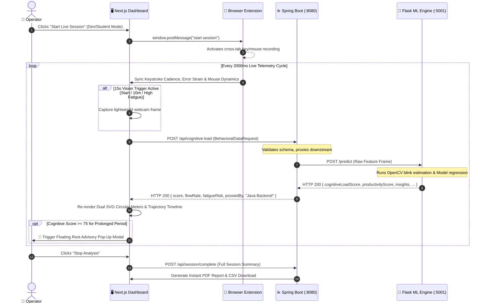

# 🧠 NeuroTrack AI — Real-Time Multimodal Cognitive Load & Mental Fatigue Telemetry Platform

<div align="center">


-10b981?style=for-the-badge)

<p align="center">
  <b>An end-to-end multimodal cognitive ergonomics platform that measures real-time mental workload, interaction strain, and physical fatigue using continuous behavioural keystroke/mouse dynamics and 15-second privacy-preserving OpenCV facial vision scans.</b>
</p>

</div>

---

## 📑 Table of Contents

1. [System Architecture Overview](#-system-architecture-overview)
2. [End-to-End Multimodal Data Pipeline](#-end-to-end-multimodal-data-pipeline)
3. [Component Breakdown](#-component-breakdown)
   - [1. Frontend (`frontend/`)](#1-frontend-frontend)
   - [2. Backend API Gateway (`Backend/`)](#2-backend-api-gateway-backend)
   - [3. Machine Learning Engine (`ml/`)](#3-machine-learning-engine-ml)
   - [4. Browser Extension (`frontend/public/extension/`)](#4-browser-extension-collector)
4. [Mathematical Formulation & Scoring Logic](#-mathematical-formulation--scoring-logic)
5. [Installation & Local Setup](#-installation--local-setup)
6. [API Specification & Payload Examples](#-api-specification--payload-examples)
7. [Privacy & Security Guarantee](#-privacy--security-guarantee)
8. [Production Deployment Guide](#-production-deployment-guide)

---

## 🏛️ System Architecture Overview

NeuroTrack operates as a **3-Tier Synchronous Distributed System**:



---

## 🔄 End-to-End Multimodal Data Pipeline

The sequence below illustrates the live 2-second streaming loop that computes Cognitive Load, Productivity Flow, and Fatigue Risk in real time:



---

## 📂 Component Breakdown

### 1. Frontend (`frontend/`)
- **Framework**: Next.js 16.2.9 (App Router) + React 19.
- **Styling**: Vanilla CSS custom design tokens + Tailwind CSS with full dynamic Light/Dark contrast adaptability.
- **Visuals & Charts**:
  - `LiveScoreGauge.js`: Dual high-precision circular SVG meters for Cognitive Load Index (`/100`) and Productivity Flow (`%`).
  - `DashboardCharts.js`: Real-time Recharts Area timeline with gradient multi-stream tracking.
  - `LiveWebcamPreview.js`: 15-second ephemeral smart vision HUD with auto-shutoff timer.
- **Hooks**:
  - `useKeyboardTracker.js`: Measures WPM, backspace correction stress, and inter-key variance (single-event precision).
  - `useMouseTracker.js`: Tracks Euclidean cursor distance, velocity, and micro-idle states.
  - `useWebcamTracker.js`: Manages 15-second hardware triggers with automated auto-off safety.

### 2. Backend API Gateway (`Backend/`)
- **Framework**: Java 21 / 17 + Spring Boot 3.4.3.
- **Core Controller**: `CognitiveLoadController.java`
  - Endpoints:
    - `POST /api/cognitive-load`: Validates incoming frontend telemetry and proxies to Python ML engine using `RestTemplate`.
    - `POST /api/session/complete`: Persists session completion summaries and exports audit records.
    - `GET /api/health`: Healthcheck endpoint reporting downstream Python ML connectivity.
  - Configuration: CORS pre-flight filter configured for `http://localhost:3000` with automated fallback payload resilience.

### 3. Machine Learning Engine (`ml/`)
- **Framework**: Python 3.10+ + Flask + Scikit-Learn + OpenCV (`cv2`).
- **Core Script**: `ml/ai_cognitive_load/app.py`
  - Model: `cognitive_load_model.pkl` trained on multi-feature behavioural time-series.
  - Facial Feature Extraction: Computes Eye Aspect Ratio (EAR), blink frequency, and head pose angle from base64 frames.
  - Role-Calibrated Adaptive Heuristic: Adjusts sensitivity curves based on whether the operator is in `Developer` (high burst tolerance) or `Student` (reading cadence) mode.

### 4. Browser Extension Collector (`frontend/public/extension/`)
- **Manifest**: Chrome Manifest V3.
- **Functionality**:
  - Runs in background across all open browser tabs (Google, GitHub, StackOverflow, etc.).
  - Captures cross-tab context switches, global key cadence, and blur events.
  - Relays telemetry securely to the Next.js Dashboard via `window.postMessage`.

---

## 📐 Mathematical Formulation & Scoring Logic

The Cognitive Load Index ($CLI \in [0, 100]$) is computed through a weighted combination of behavioral entropy, correction strain, and facial fatigue:

$$CLI = w_k \cdot K_{strain} + w_m \cdot M_{intensity} + w_v \cdot V_{fatigue} + w_c \cdot C_{blur}$$

Where:
- **Keystroke Error Strain ($K_{strain}$)**:
  $$K_{strain} = \min\left(100, \left(\frac{\text{Backspaces}}{\max(1, \text{Total Keystrokes})} \times 350\right) + \frac{\text{Delay Variance}}{\sigma_0}\right)$$
- **Cursor Inactivity & Friction ($M_{intensity}$)**:
  $$M_{intensity} = \min\left(100, \frac{\text{Idle Seconds}}{60} \times 40 + \text{Click Burst Factor}\right)$$
- **Facial Strain ($V_{fatigue}$)**:
  $$V_{fatigue} = \text{Blink Frequency Index} \times 0.6 + \text{Head Pose Sag Angle} \times 0.4$$
- **Context Blur ($C_{blur}$)**:
  $$C_{blur} = \min(100, \text{Tab Switches} \times 4.5)$$

---

## 🚀 Installation & Local Setup

### Prerequisites
- **Node.js**: `v18.x` or `v20.x`
- **Java JDK**: `v17` or `v21` + Maven
- **Python**: `v3.10` or higher

---

### Step 1: Start Python ML Engine
```bash
# Navigate to ML directory
cd ml/ai_cognitive_load

# Install Python dependencies
pip install -r requirements.txt

# Start ML Flask Server (Port 5001)
python app.py
```
> Server running at: `http://localhost:5001`

---

### Step 2: Start Java Spring Boot Backend
Open a second terminal:
```bash
# Navigate to Backend directory
cd Backend

# Run via Maven Wrapper
./mvnw spring-boot:run
```
> Backend running at: `http://localhost:8080`

---

### Step 3: Start Next.js Frontend
Open a third terminal:
```bash
# Navigate to Frontend directory
cd frontend

# Install Node dependencies
npm install

# Start Next.js Turbopack dev server
npm run dev
```
> Application accessible at: `http://localhost:3000`

---

### Step 4: Install Chrome Extension (Optional for Multi-Tab Tracking)
1. Open Google Chrome and go to `chrome://extensions`.
2. Toggle on **Developer mode** (top-right).
3. Click **Load unpacked** and select the folder:
   `frontend/public/extension`
4. You are ready! Keystrokes and tab switches across all browser tabs will now stream to your dashboard.

---

## 📡 API Specification & Payload Examples

### `POST http://localhost:8080/api/cognitive-load`

#### Request Payload (Frontend ➔ Spring Boot ➔ ML):
```json
{
  "typingSpeed": 54,
  "keystrokes": 128,
  "backspaceCount": 4,
  "mouseClicks": 18,
  "mouseDistance": 2450.5,
  "mouseSpeed": 1.45,
  "tabSwitches": 2,
  "windowFocusChanges": 1,
  "sessionDuration": 95,
  "role": "developer",
  "task": "coding",
  "hasWebcamFrame": true,
  "webcamFrame": "data:image/jpeg;base64,/9j/4AAQSkZJRg..."
}
```

#### Response Payload (ML ➔ Spring Boot ➔ Frontend):
```json
{
  "cognitiveLoadScore": 34.2,
  "productivityScore": 65.8,
  "fatigueRisk": "Low",
  "attentionIndex": 88.5,
  "typingStability": 92.0,
  "mouseEfficiency": 84.1,
  "insights": [
    "Stable typing rhythm detected with low correction friction.",
    "Interaction flow is optimal for deep coding."
  ],
  "recommendations": [
    "Focus state optimal. Maintain continuous workflow."
  ],
  "proxiedBy": "Java Spring Boot Backend",
  "timestamp": "2026-08-26T20:25:00.000Z"
}
```

---

## 🔒 Privacy & Security Guarantee

1. **100% Ephemeral Vision**: OpenCV facial feature scans execute exclusively in short **15-second bursts**. No raw video or image frames are ever saved, stored, or written to disk.
2. **On-Device Cadence Aggregation**: Keystroke timing measures inter-key interval delays ($\Delta t$) and count frequencies — raw text content and sensitive passwords are never logged.
3. **Hardware Kill-Switch**: The webcam hardware light turns off immediately upon completion of the 15-second sampling burst.

---

## 🌐 Production Deployment Guide

| Tier | Service | Build Command | Start Command |
| :--- | :--- | :--- | :--- |
| **Frontend** | [Vercel](https://vercel.com) | `npm run build` | `npm run start` |
| **Backend** | [Render](https://render.com) | `./mvnw clean package -DskipTests` | `java -jar target/*.jar` |
| **ML Engine**| [Railway](https://railway.app) | `pip install -r requirements.txt` | `gunicorn -w 2 -b 0.0.0.0:$PORT app:app` |

---

<div align="center">
  <sub>Developed with ❤️ by the NeuroTrack AI Team • Empowering Healthy Digital Ergonomics</sub>
</div>
